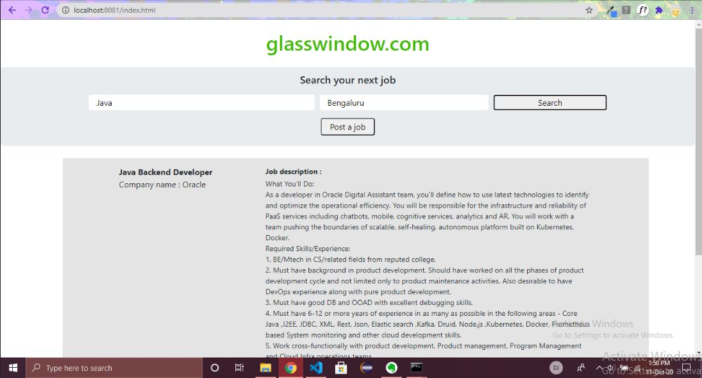

# glasswindow
A simple job portal web application. It has two main APIs exposed. You can access them through 
 - GET(http://localhost:8081/jobs?skillKeywords=&location=) to get the active jobs based on skillKeywords and location. 
 - PUT(http://localhost:8081/jobs) to put a new job into the database. The application has a MVCS structure and I have tested the repository service layer, which has the primary functionalities. It has a simple static webpage attached(index.html) to help with the UI.

Screenshot of searching jobs

Screenshot of posting a new job

### Environment setup
 - JDK 12.0.2
 - Gradle 6.6.1
 - MongoDB 4.4.0
 
### Running the application
1. Run mongoDB server on your local machine(I have currently not used a mongo cluster, which is subject to change in future. I will updtae it here accordingly).
2. Type ./gradlew bootrun.
3. Open http://localhost:8081/index.html in your browser.

### Authors
Manish Das(manishdasa100@gmail.com) 
